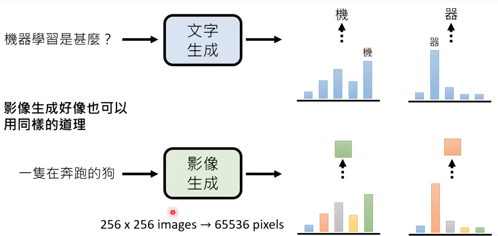
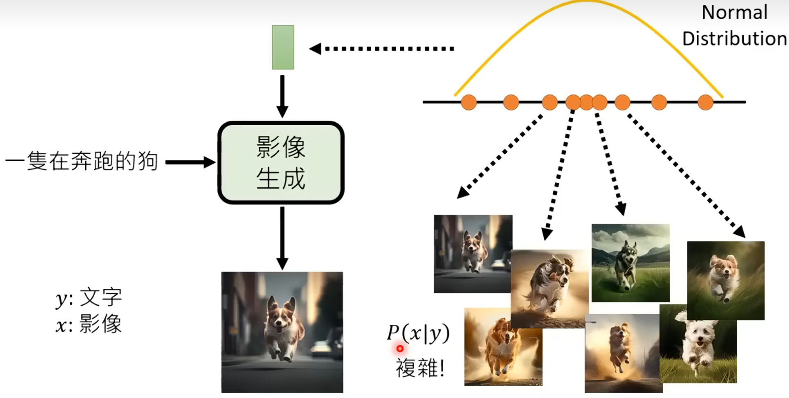

# 图片

​	对于一张彩色图片而言，它有RGB三通道。**R通道**：记录图像中每个像素的**红色分量强度**（通常用0~255的数值表示，0表示无红色，255表示红色最亮）。**G通道**：记录**绿色分量强度**。**B通道**：记录**蓝色分量强度**。对于图片中的某一个像素而言，它有256x256x256种颜色，RGB三个通道组合而成。

# 深度生成模型

​	文本生成，图片生成，视频生成。

​	对于一个输入，可以有多种，甚至无穷种回答。输出可能比输入更加复杂且高纬

​	一段文字转换为一个模型，模型需要进行大量的脑补。因为图片对应的文字有很多，一张图胜过千言万语。

​	对于文字生成而言，主要采取逐个击破（Autoregressive，自回归），从输入文本计算出最可能的下一个字或者词（计算概率，选概率最大的），然后将其追加到输入文本的末尾，作为新的输入。然后重复，直到生成结束标记；图片生成的话，也可以采取这种方式进行。要画一只奔跑的狗，计算第一个像素最可能为什么颜色（概率最大），然后将第一个像素和文字作为新的输入，重复，知道生成结束标记。太浪费时间，==现在的图像生成不使用Autorgessvie自回归！！！==

​	image-gpt：将2D图像转换为1D序列（得到256排的256个token），对于每一排的256个token，从输入token计算出最可能的下一个token，然后将其追加到输入token的末尾，作为新的输入。然后重复，直到生成结束标记。然后**图片生成都是一排一排生成出来的**。

、

​	一步到位生成：直接预测256x256个每个像素点的颜色。得到的结果就是一个分布之内的，在这个分布之内的都是正确的输出。但是使用一步到位生成会导致每个像素点可能要画的图不一样（例如有的像素点是想画黑狗，有的想画白狗，有的向前跑，有的向后退，....）

​	为了解决这个问题，就需要使用Normal Distribution。通过Normal Distribution 得到可能的图片P(x|y)，然后文字就帮忙指导映射。

# Variational Auto-encoder(VAE)

​	把Normal Distribution采样得到的向量放进Decoder中

## AE和VAE结构

AE（自编码器）的核心是**编码-解码-重建**，结构如下：

- **输入**：原始图像 $X$（高维数据）
- **Encoder（编码器）**：将 $X$ 降维到低维隐空间（Latent Space），得到一个确定的隐向量 $z$（$z = \text{Encoder}(X)$）
- **Decoder（解码器）**：将隐向量 $z$ 升维，还原回高维图像 $\hat{X}$（$\hat{X} = \text{Decoder}(z)$）
- **训练目标**：最小化**重建误差**（比如像素级MSE），即让 $\hat{X} \approx X$

​	AE能做好**降维+重建**，但没法**生成新数据**——因为训练后，每个 $X_i$ 和 $z_i$ 是**一一对应**的（隐空间是"离散点"分布）。如果随机采样一个不在训练集中的 $z$，Decoder会生成无意义的垃圾数据（隐空间缺乏"连续性"和"分布规律"）。点到点的映射（像是一个**死记硬背的学生**记住了全部的问题和答案（Xᵢ ↔ zᵢ），考试时只出原题就能答对（重建），但稍微变化一下题目，就完全不会了（无法生成））。

​	**核心需求**：给隐空间 $z$ 加**分布约束**，让 $z$ 服从已知概率分布（如标准正态分布 $\mathcal{N}(0,1)$），这样就能从该分布中随机采样 $z$，通过Decoder生成新数据。这是VAE的核心动机。

​	VAE（变分自编码器）保留AE的**编码-解码**结构，但对Encoder做关键修改，同时引入新的Loss项，解决"生成能力"问题。给隐空间加"分布约束"。分布到分布的映射（像是一个**理解规律的学生**，不仅记住答案，还理解了**答案背后的分布规律**，知道所有答案都符合某种"语法"或"规则"，即使遇到新问题，也能根据规则生成合理答案）。

- **Encoder（变分编码器）**：不再输出确定的 $z$，而是输出**概率分布的参数**——均值 $\mu$ 和方差 $\sigma^2$：
  $$
  \mu = f_1(X), \quad \log\sigma^2 = f_2(X)
  $$
  含义：对于输入 $X$，其隐向量 $z$ 不是一个点，而是服从高斯分布 $\mathcal{N}(\mu, \sigma^2)$ 的随机变量。

- **采样步骤**：从 $\mathcal{N}(\mu, \sigma^2)$ 中随机采样一个 $z$（生成能力的关键，后续用重参数化解决梯度问题）。

- **Decoder（解码器）**：和AE一致，输入采样得到的 $z$，输出重建图像 $\hat{X}$，对应条件概率 $p(X|z)$（"给定 $z$，生成 $X$ 的概率"）。

## VAE的Loss

VAE的Loss是**重建Loss + KL散度**，本质是平衡两个矛盾：

- 采样的随机性会导致重建误差增大（每次采样的 $z$ 不同，$\hat{X}$ 也不同）→ 网络倾向于让方差 $\sigma^2 \to 0$（退化成AE，失去生成能力）。
- 需要 $z$ 服从标准正态分布 $\mathcal{N}(0,1)$（保证隐空间连续性，方便采样生成）→ 必须约束 $\mathcal{N}(\mu, \sigma^2)$ 贴近 $\mathcal{N}(0,1)$。

首先给出完整的VAE损失函数（对于单个样本$X$）：
$$
\mathcal{Loss}_{\text{VAE}}(\theta, \phi; X) = \underbrace{\mathbb{E}_{q_\phi(z|X)}[\log p_\theta(X|z)]}_{\text{重建Loss}} - \beta \cdot \underbrace{D_{\text{KL}}(q_\phi(z|X) \parallel p(z))}_{\text{KL散度正则项约束}}
$$

- | $X$      | 观测数据（输入） | 向量 $\mathbb{R}^D$ | 例如：一张$28×28$的MNIST图像展平为$784$维向量 |
  | -------- | ---------------- | ------------------- | --------------------------------------------- |
  | $z$      | **隐变量**       | 向量 $\mathbb{R}^d$ | 潜在表示，$d \ll D$（如$d=20$）               |
  | $\theta$ | **解码器参数**   | 神经网络权重        | 解码器$p_\theta(x|z)$的参数                   |
  | $\phi$   | **编码器参数**   | 神经网络权重        | 编码器$q_\phi(z|x)$的参数                     |
  | $\beta$  | **正则化系数**   | 标量 $\mathbb{R}^+$ | 控制KL散度的权重，$\beta=1$时为标准VAE        |

- **第一项           $\mathbb{E}_{q_\phi(z|x)}[\log p_\theta(x|z)]= \int \log p_\theta(x|z) \cdot q_\phi(z|x) dz$ （重建Loss）**

  - 和AE一致，让 $\hat{X}$($\hat{X}=\log p(X|z) \approx X$)越大，重建效果越好。从编码器分布$q_\phi(z|x)$中**采样**多个$z$，对每个$z$计算$\log p_\theta(x|z)$（重建质量），然后取**平均值**。
  - **$q_\phi(z|X)$**：变分后验分布，给定$X$时，$z$的近似后验分布，编码器建模。多元高斯分布$$q_\phi(z|X) = \mathcal{N}(z; \mu_\phi(X), \text{diag}(\sigma^2_\phi(X)))$$
    - 编码器输出两个向量：$\mu_\phi(x) \in \mathbb{R}^d$均值向量，$\log\sigma^2_\phi(x) \in \mathbb{R}^d$对数方差向量
  - **$\log p_\theta(X|z)$**：**对数条件似然函数 **（在给定$z$的条件下，数据$X$出现的"可能性"的对数，越大表示重建效果越好）
  - **$p_\theta(x|z)$**：**条件似然函数**（给定隐变量$z$时，生成观测数据$X$的概率，由**解码器**建模），为二值数据或者连续数据
    - **二值数据**（如MNIST二值图）：伯努利分布$$p_\theta(X|z) = \prod_{i=1}^D [\pi_i(z)]^{x_i}[1-\pi_i(z)]^{1-x_i}$$，其中$\pi_i(z) \in [0,1]$是解码器第$i$个输出（sigmoid激活）。$$\log p_\theta(X|z) = \sum_{i=1}^D [X_i \log \pi_i(z) + (1-X_i)\log(1-\pi_i(z))]$$，这就是**交叉熵损失**！
    - **连续数据**（如灰度图）：高斯分布$$p_\theta(X|z) = \prod_{i=1}^D \frac{1}{\sqrt{2\pi\sigma^2}} \exp\left(-\frac{(X_i - \mu_i(z))^2}{2\sigma^2}\right)$$, 通常固定$\sigma=1$，解码器输出均值$\mu(z)$。$$\log p_\theta(X|z) = -\frac{1}{2}\sum_{i=1}^D (X_i - \mu_i(z))^2 + \text{常数}$$，这就是**均方误差（MSE）** 的负值！

- **第二项        $D_{\text{KL}}(q_\phi(z|x) \parallel p(z))$（KL散度）**：

  -  KL散度定义：$ D_{\text{KL}}(q \parallel p) = \int q(z) \log\frac{q(z)}{p(z)} dz $，衡量两个概率分布$q$和$p$之间的"差异"或"距离"。
  -  衡量解码器输出分布 $q(z|X) = \mathcal{N}(\mu, \sigma^2)$ 与目标先验分布 $p(z) = \mathcal{N}(0,1)$ 差距，KL越小分布越近，隐空间越符合正态分布。
     - **$q_\phi(z|x) = \mathcal{N}(z; \mu, \text{diag}(\sigma^2))$**：编码器输出的分布，其中$\mu = \mu_\phi(x)$，$\sigma^2 = \sigma^2_\phi(x)$
     - $p(z) = \mathcal{N}(z; 0, I)$：先验分布，标准多元正态分布

- **负号**：最大化重建（$\log p(X|z)$ 越大越好）+ 最小化KL散度，合并后为"重建项-KL项"，整体目标是最大化Loss/最小化其负值。

## ELBO

生成模型的终极目标是**学习数据的真实分布 $p(X)$**——只要学到 $p(X)$，就能从该分布中采样生成新数据。

但直接估计 $p(X)$ 极难（如图像数据分布复杂，无简单公式描述），因此VAE引入**隐变量 $z$**，将 $p(X)$ 分解为：
$$
p(X) = \int p(X|z) p(z) dz
$$

- **含义**：数据 $X$ 的生成过程是"先从先验分布 $p(z)$ 采样 $z$，再从条件分布 $p(X|z)$ 采样 $X$"
- **问题**：高维隐空间的积分是NP难的，无法直接计算

为解决积分难题，VAE采用**变分推断**：引入可参数化的近似后验分布 $q(z|X)$（即Encoder输出的 $\mathcal{N}(\mu, \sigma^2)$），用它近似无法计算的真实后验 $p(z|X)$（"给定 $X$，隐变量 $z$ 的真实分布"）。

衡量两个分布相似度的指标是**KL散度**：$KL(q(z|X) \parallel p(z|X)) \geq 0$（KL散度永远非负，等于0时两个分布完全一致）。

目标是最大化**对数似然 $\log p(X)$**（极大似然估计，让模型生成真实数据的概率最大）。通过数学变形，可将 $\log p(X)$ 拆分为**ELBO + KL散度**：
$$
\begin{aligned}
\log p(X) &= \mathbb{E}_{q(z|X)}[\log p(X)] \quad (\text{乘以} \int q(z|X)dz=1\text{，不改变结果}) \\
&= \mathbb{E}_{q(z|X)}\left[\log \frac{p(X,z)}{p(z|X)}\right] \quad (\text{贝叶斯公式：} p(X,z)=p(X|z)p(z)=p(z|X)p(X)) \\
&= \mathbb{E}_{q(z|X)}\left[\log \frac{p(X,z) q(z|X)}{p(z|X) q(z|X)}\right] \quad (\text{分子分母同乘} q(z|X)) \\
&= \underbrace{\mathbb{E}_{q(z|X)}\left[\log \frac{p(X,z)}{q(z|X)}\right]}_{\text{ELBO}} + \underbrace{KL(q(z|X) \parallel p(z|X))}_{\geq 0}
\end{aligned}
$$

因 $KL(q \parallel p) \geq 0$，故：
$$
\log p(X) \geq \text{ELBO}
$$

- $\log p(X)$ 是**模型证据**（Model Evidence），衡量模型对数据的拟合程度
- ELBO是**证据下界**（Evidence Lower Bound）——它是 $\log p(X)$ 的下界，最大化ELBO等价于最大化 $\log p(X)$（当KL=0时，ELBO=log p(X)）

对ELBO进一步变形，可得VAE的Loss：
$$
\begin{aligned}
\text{ELBO} &= \mathbb{E}_{q(z|X)}\left[\log \frac{p(X,z)}{q(z|X)}\right] \\
&= \mathbb{E}_{q(z|X)}\left[\log \frac{p(X|z) p(z)}{q(z|X)}\right] \quad (\text{分解联合分布} p(X,z)=p(X|z)p(z)) \\
&= \mathbb{E}_{q(z|X)}[\log p(X|z)] + \mathbb{E}_{q(z|X)}\left[\log \frac{p(z)}{q(z|X)}\right] \\
&= \mathbb{E}_{q(z|X)}[\log p(X|z)] - KL(q(z|X) \parallel p(z))
\end{aligned}
$$

这与之前的VAE Loss完全一致！

**结论**：VAE的训练目标**最大化ELBO**，本质是通过近似后验 $q(z|X)$ 间接最大化模型证据 $\log p(X)$，既保证重建效果，又约束隐空间分布，从而获得生成能力。

# Flow-based Generative Model

​	很多照片输入，输出是Normal Distribution

# Generative Adversarial Network(GAN)

# Diffusion Model

